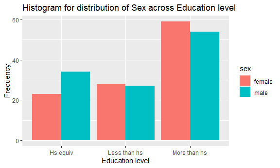
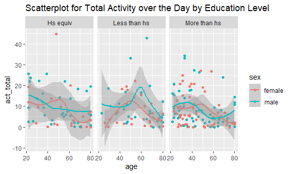
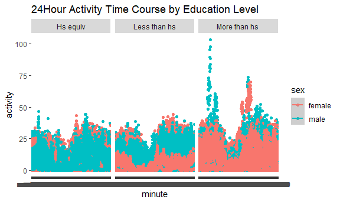

HW 3
================
Nandini M
2023-10-14

``` r
library(tidyverse)
```

    ## -- Attaching core tidyverse packages ------------------------ tidyverse 2.0.0 --
    ## v dplyr     1.1.3     v readr     2.1.4
    ## v forcats   1.0.0     v stringr   1.5.0
    ## v ggplot2   3.4.3     v tibble    3.2.1
    ## v lubridate 1.9.2     v tidyr     1.3.0
    ## v purrr     1.0.2     
    ## -- Conflicts ------------------------------------------ tidyverse_conflicts() --
    ## x dplyr::filter() masks stats::filter()
    ## x dplyr::lag()    masks stats::lag()
    ## i Use the conflicted package (<http://conflicted.r-lib.org/>) to force all conflicts to become errors

``` r
library(ggridges)
library(patchwork)
library(p8105.datasets)

knitr::opts_chunk$set(
  fig.width = 6,
  fig.asp = .6,
  out.width = "90%"
)
```

## Problem 1 Solutions:

Load in data

``` r
data("instacart")

instacart = 
  instacart |> 
  as_tibble()
```

#### Answer questions about the data

The dataset contains 1384617 rows and 15 columns where each row is a
single product from an instacart order. Variables include identifiers
for user, order, and product; the order in which each product was added
to the cart. There are several order-level variables, describing the day
and time of the order, and number of days since prior order. Then there
are several item-specific variables, describing the product name
(e.g. Yogurt, Avocado), department (e.g. dairy and eggs, produce), and
aisle (e.g. yogurt, fresh fruits), and whether the item has been ordered
by this user in the past. In total, there are 39123 products found in
131209 orders from 131209 distinct users.

Below is a table summarizing the number of items ordered from aisle. In
total, there are 134 aisles, with fresh vegetables and fresh fruits
holding the most items ordered by far.

``` r
instacart |> 
  count(aisle) |> 
  arrange(desc(n))
```

    ## # A tibble: 134 x 2
    ##    aisle                              n
    ##    <chr>                          <int>
    ##  1 fresh vegetables              150609
    ##  2 fresh fruits                  150473
    ##  3 packaged vegetables fruits     78493
    ##  4 yogurt                         55240
    ##  5 packaged cheese                41699
    ##  6 water seltzer sparkling water  36617
    ##  7 milk                           32644
    ##  8 chips pretzels                 31269
    ##  9 soy lactosefree                26240
    ## 10 bread                          23635
    ## # i 124 more rows

Next is a plot that shows the number of items ordered in each aisle.
Here, aisles are ordered by ascending number of items.

``` r
instacart |> 
  count(aisle) |> 
  filter(n > 10000) |> 
  mutate(aisle = fct_reorder(aisle, n)) |> 
  ggplot(aes(x = aisle, y = n)) + 
  geom_point() + 
  labs(title = "Number of items ordered in each aisle") +
  theme(axis.text.x = element_text(angle = 60, hjust = 1))
```


Our next table shows the three most popular items in aisles
`baking ingredients`, `dog food care`, and `packaged vegetables fruits`,
and includes the number of times each item is ordered in your table.

``` r
instacart |> 
  filter(aisle %in% c("baking ingredients", "dog food care", "packaged vegetables fruits")) |>
  group_by(aisle) |> 
  count(product_name) |> 
  mutate(rank = min_rank(desc(n))) |> 
  filter(rank < 4) |> 
  arrange(desc(n)) |>
  knitr::kable()
```

| aisle                      | product_name                                  |    n | rank |
|:---------------------------|:----------------------------------------------|-----:|-----:|
| packaged vegetables fruits | Organic Baby Spinach                          | 9784 |    1 |
| packaged vegetables fruits | Organic Raspberries                           | 5546 |    2 |
| packaged vegetables fruits | Organic Blueberries                           | 4966 |    3 |
| baking ingredients         | Light Brown Sugar                             |  499 |    1 |
| baking ingredients         | Pure Baking Soda                              |  387 |    2 |
| baking ingredients         | Cane Sugar                                    |  336 |    3 |
| dog food care              | Snack Sticks Chicken & Rice Recipe Dog Treats |   30 |    1 |
| dog food care              | Organix Chicken & Brown Rice Recipe           |   28 |    2 |
| dog food care              | Small Dog Biscuits                            |   26 |    3 |

Finally is a table showing the mean hour of the day at which Pink Lady
Apples and Coffee Ice Cream are ordered on each day of the week. This
table has been formatted in an untidy manner for human readers. Pink
Lady Apples are generally purchased slightly earlier in the day than
Coffee Ice Cream, with the exception of day 5.

``` r
instacart |>
  filter(product_name %in% c("Pink Lady Apples", "Coffee Ice Cream")) |>
  group_by(product_name, order_dow) |>
  summarize(mean_hour = mean(order_hour_of_day)) |>
  pivot_wider(
    names_from = order_dow, 
    values_from = mean_hour) |>
  knitr::kable(digits = 2)
```

    ## `summarise()` has grouped output by 'product_name'. You can override using the
    ## `.groups` argument.

| product_name     |     0 |     1 |     2 |     3 |     4 |     5 |     6 |
|:-----------------|------:|------:|------:|------:|------:|------:|------:|
| Coffee Ice Cream | 13.77 | 14.32 | 15.38 | 15.32 | 15.22 | 12.26 | 13.83 |
| Pink Lady Apples | 13.44 | 11.36 | 11.70 | 14.25 | 11.55 | 12.78 | 11.94 |

## Problem 3

Load in data

``` r
demo_df = 
  read_csv("Data/nhanes_covar.csv", skip = 4)
```

    ## Rows: 250 Columns: 5
    ## -- Column specification --------------------------------------------------------
    ## Delimiter: ","
    ## dbl (5): SEQN, sex, age, BMI, education
    ## 
    ## i Use `spec()` to retrieve the full column specification for this data.
    ## i Specify the column types or set `show_col_types = FALSE` to quiet this message.

``` r
demo_df = janitor::clean_names(demo_df) |> 
  mutate(
    sex = 
      case_match(
        sex, 
         1 ~ "male", 
         2 ~ "female"
        ),
    education = 
      case_match(
        education,
         1 ~ "Less than hs",
         2 ~ "Hs equiv",
         3 ~ "More than hs"
       )
  )

accel_df = 
  read_csv("Data/nhanes_accel.csv")
```

    ## Rows: 250 Columns: 1441
    ## -- Column specification --------------------------------------------------------
    ## Delimiter: ","
    ## dbl (1441): SEQN, min1, min2, min3, min4, min5, min6, min7, min8, min9, min1...
    ## 
    ## i Use `spec()` to retrieve the full column specification for this data.
    ## i Specify the column types or set `show_col_types = FALSE` to quiet this message.

``` r
accel_df = janitor::clean_names(accel_df)
```

Clean and merge data

``` r
clean_demo = 
  filter(demo_df, age > 21) |> 
  drop_na()

both = left_join(clean_demo, accel_df, by = "seqn")
```

``` r
both |> 
  group_by(education) |> 
  count(sex) |> 
  knitr::kable()
```

| education    | sex    |   n |
|:-------------|:-------|----:|
| Hs equiv     | female |  23 |
| Hs equiv     | male   |  34 |
| Less than hs | female |  28 |
| Less than hs | male   |  27 |
| More than hs | female |  59 |
| More than hs | male   |  54 |

``` r
ggplot(both, aes(x=education, fill=sex)) +
  geom_histogram(stat = "count",position = "dodge") +
  labs(
    title = "Histogram for distribution of Sex across Education level",
    x = "Education level",
    y = "Frequency"
  )
```

    ## Warning in geom_histogram(stat = "count", position = "dodge"): Ignoring unknown
    ## parameters: `binwidth`, `bins`, and `pad`



Most of the data appears to come from men and women with more than a
high school education. There are 54 males and 59 females with more than
a high school education in the dataset. Individuals in the Hs equiv and
Less than hs categories appear to be underrepresented.

``` r
total = 
  mutate(both, 
         act_total = rowSums(across(c(min1,min1440)))) |> 
  select(seqn, age, sex, education, act_total)

gg_scatter = 
  total |> 
  ggplot(aes(x = age, y = act_total, color = sex)) +
    labs(title = "Scatterplot for Total Activity over the Day by Education Level"
  ) +
  geom_point() +
  geom_smooth() +
  facet_grid(. ~ education) 

gg_scatter
```

    ## `geom_smooth()` using method = 'loess' and formula = 'y ~ x'



Across all three groups, there appears to be a general decline in
activity as age increases. Those who are around 20 years old seem to
have higher total activity time than those who are around 80 years old.
The only instance where this is not true is for females designated
within the less than high school category. Also, there seems to be a
spike in activity for those in their 50s and 60s. However, this is not
true for males designated in the Hs equiv category - there was only a
decrease in the trendline, and for males designated within the More than
hs category - the spike occurred around the 30 years age range.

``` r
all_day = 
  both |> 
  pivot_longer(
    min1:min1440,
    names_to = "minute",
    values_to = "activity"
  )

gg_scatter2 = 
  all_day |> 
  ggplot(aes(x = minute, y = activity, color = sex)) +
  labs(title = "24Hour Activity Time Course by Education Level"
  ) +
  geom_point() +
  geom_smooth() +
  facet_grid(. ~ education) 

gg_scatter2
```

    ## `geom_smooth()` using method = 'loess' and formula = 'y ~ x'



The plots looks very similar between those in the Hs equiv and Less than
hs categories. Both start around 25-30 activity level at the beginning
of the day and then there’s is a dip. Both groups park around 45-50
before slightly decreasing at the end of the day. For those in the More
than hs category, the activity level is higher at the start of the day
which is around 35-40. There is a similar dip which then rises up again
and peaks around 55-60 before decreasing towards the end of the day.
Looking at these plots side by side, it appears as though the
individuals in the More than hs category are overall more active
throughout the day compares to the other two groups.
